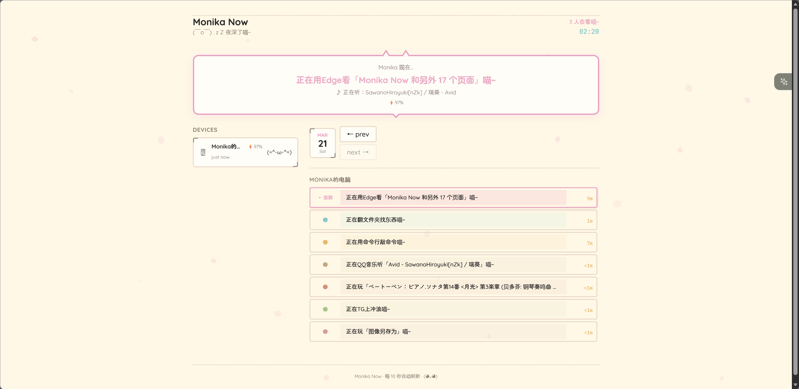
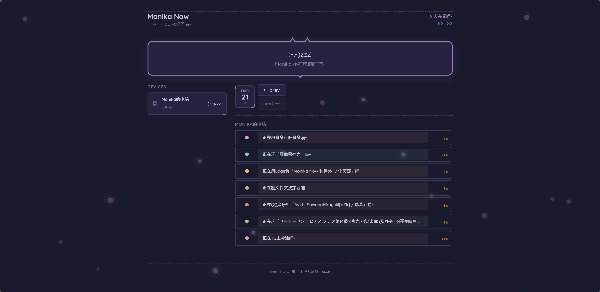

# Live Dashboard

实时设备活动仪表盘 — 公开展示你正在使用的应用，拥有二次元风格 UI 和隐私优先设计。

在线演示：https://now.monikadream.homes/

## 截图

**日间模式（设备在线）**



**夜间模式（设备离线）**



## 特色

- 猫耳装饰的视觉小说风格对话框 + 中文戏剧化活动描述
- 飘落的樱花花瓣动画，夜间自动切换萤火主题
- 四级隐私系统（SHOW / BROWSER / HIDE / SECRET）——银行、密码管理器等私密应用整应用匿名化，只留时长不留痕
- 多面板聚合：环境变量配置好友的仪表盘，一个页面切换围观（只读代理，不暴露任何管理接口）
- 自定义应用映射：挂载一个 JSON 文件即可新增/覆盖应用名与文案，无需改代码重构建
- 系统托盘常驻 + AFK 检测（看视频/听歌时自动豁免）
- 音乐检测（Spotify、QQ音乐、网易云等）
- Health Connect 健康数据同步（Android）
- 多设备多平台支持（Windows / macOS / Android）

## 快速开始

```bash
# 1. 生成密钥
TOKEN=$(openssl rand -hex 16)
SECRET=$(openssl rand -hex 32)

# 2. 启动
docker run -d --name live-dashboard \
  -p 3000:3000 \
  -v dashboard_data:/data \
  -e HASH_SECRET=$SECRET \
  -e DEVICE_TOKEN_1=$TOKEN:my-pc:MyPC:windows \
  ghcr.io/monika-dream/live-dashboard:latest

# 3. 打开 http://localhost:3000
echo "Token: $TOKEN  ← Agent 配置用"
```

详细部署说明（docker-compose、VPS + Nginx + HTTPS）见 [Wiki - 快速部署](https://github.com/Monika-Dream/live-dashboard/wiki/快速部署)。

## Agent 下载

从 [GitHub Releases](https://github.com/Monika-Dream/live-dashboard/releases) 下载对应平台的客户端：

| 平台 | 下载文件 | 配置指南 |
|------|---------|---------|
| Windows | `live-dashboard-agent.exe` | [Wiki - Windows Agent](https://github.com/Monika-Dream/live-dashboard/wiki/Agent-配置-Windows) |
| macOS | `live-dashboard-agent-macos.zip` | [Wiki - macOS Agent](https://github.com/Monika-Dream/live-dashboard/wiki/Agent-配置-macOS) |
| Android | `live-dashboard.apk` | [Wiki - Android App](https://github.com/Monika-Dream/live-dashboard/wiki/Agent-配置-Android) |

## 主题

| 分支 | 风格 | 说明 |
|------|------|------|
| `main` | 经典和风 | 暖粉色系、猫耳气泡框、樱花花瓣 |
| `redesign/blossom-letter` | 花信 · 文艺书卷 | OKLCH 暖纸色、双栏布局、AI 每日总结 |
| `redesign/pixel-room` | 像素房间 | 像素风 + 日夜切换（开发中） |

## 分支结构

| 分支 | 内容 |
|------|------|
| `main` | 后端 + 前端 + Docker + CI |
| `windows-source` | Windows Agent 源码（Python） |
| `macos-source` | macOS Agent 源码（Python） |
| `android-source` | Android App 源码（Kotlin） |

## 技术栈

| 组件 | 技术 |
|------|------|
| 后端 | Bun + TypeScript + SQLite |
| 前端 | Next.js 15 + React 19 + Tailwind CSS 4（静态导出） |
| Windows Agent | Python + Win32 API + pystray + pycaw |
| macOS Agent | Python + AppleScript + pystray |
| Android App | Kotlin + Jetpack Compose + Health Connect |
| 部署 | Docker 多阶段构建 + Nginx |

## 文档

完整文档见 [GitHub Wiki](https://github.com/Monika-Dream/live-dashboard/wiki)：

- [快速部署](https://github.com/Monika-Dream/live-dashboard/wiki/快速部署) — Docker 一键部署
- [VPS 部署指南](https://github.com/Monika-Dream/live-dashboard/wiki/VPS-部署指南) — Nginx + HTTPS
- [功能特性](https://github.com/Monika-Dream/live-dashboard/wiki/功能特性) — 完整功能列表
- [架构与项目结构](https://github.com/Monika-Dream/live-dashboard/wiki/架构与项目结构) — 架构图 + 项目树
- [隐私分级系统](https://github.com/Monika-Dream/live-dashboard/wiki/隐私分级系统) — SHOW / BROWSER / HIDE
- [API 参考](https://github.com/Monika-Dream/live-dashboard/wiki/API-参考) — 端点、请求体、响应格式
- [环境变量](https://github.com/Monika-Dream/live-dashboard/wiki/环境变量) — 配置项一览
- [安全设计](https://github.com/Monika-Dream/live-dashboard/wiki/安全设计) — 安全特性
- [自定义](https://github.com/Monika-Dream/live-dashboard/wiki/自定义) — 显示名、元数据、主题色
- [本地开发](https://github.com/Monika-Dream/live-dashboard/wiki/本地开发) — 从源码构建

## 自定义应用映射

内置映射覆盖不到的应用，用一个 JSON 文件就能补——**不用改代码、不用重新构建镜像**：

1. 把仓库根目录的 [`custom-mappings.example.json`](custom-mappings.example.json) 复制为 `custom-mappings.json`
2. 放进数据卷（Docker 部署即 `/data/custom-mappings.json`），或用环境变量 `CUSTOM_MAPPINGS_FILE` 指定任意路径
3. 重启容器生效

格式（各段均可省略）：

```json
{
  "windows": { "mygame.exe": { "name": "我的游戏", "statusText": "正在打自己做的游戏喵~" } },
  "android": { "com.example.app": { "name": "某应用" } },
  "macos":   { "SomeApp": { "statusText": "正在用 SomeApp 干活喵~" } },
  "statusTexts": { "微信": "正在微信上谈大生意喵~" }
}
```

- `windows` / `android` / `macos` 段按原始 `app_id`（进程名 / 包名，大小写不敏感）匹配
- `statusTexts` 段按映射后的应用名匹配，用来给内置应用换文案
- **与内置条目冲突时，以你的 JSON 为准**；非法条目会被跳过并在日志里提示

想把自定义直接贡献回项目的话，改源码里的 `packages/backend/src/data/app-overrides.ts`（按 app_id 覆盖）或基础映射表 `packages/backend/src/data/app-names.json`，然后提 PR。

## 多面板聚合

想在自己的页面上同时围观朋友的仪表盘？配置 `EXTERNAL_DASHBOARDS` 环境变量（JSON 数组）即可，前端会出现面板切换器：

```bash
EXTERNAL_DASHBOARDS='[{"id":"friend1","name":"小明的面板","url":"https://now.friend.example"}]'
```

- `id` 任意唯一标识（`local` 保留给本站）；`url` 是对方站点根地址（须为 http/https）
- 数据经本站 `/api/proxy` 只读转发，浏览器不直连对方站点，也不需要对方做任何配置

## 隐私与安全

本项目的定位是"把此刻的状态公开给朋友看"，安全设计围绕"公开的只有状态，别的什么都不漏"：

- 窗口标题原文**永不落库**（仅存 HMAC-SHA256 去重哈希，`HASH_SECRET` 必填）
- 四级隐私：聊天/邮件/金融/系统工具默认隐藏标题；**银行、券商、密码管理器、验证器、政务类整应用匿名化**为"私密应用"，只保留使用时长
- 上报鉴权用 Bearer Token（`DEVICE_TOKEN_N`），公开接口只读且不含设备令牌信息
- 多面板代理只允许白名单端点（current/timeline/health-data/config）、6 秒超时、1MB 响应上限，目标地址只能来自你自己的环境变量配置
- 可选 `REQUIRE_EXPLICIT_CONSENT=1`：开启后设备必须先 POST `/api/consent` 明确同意，才能上报活动/健康数据

## 许可证

MIT
