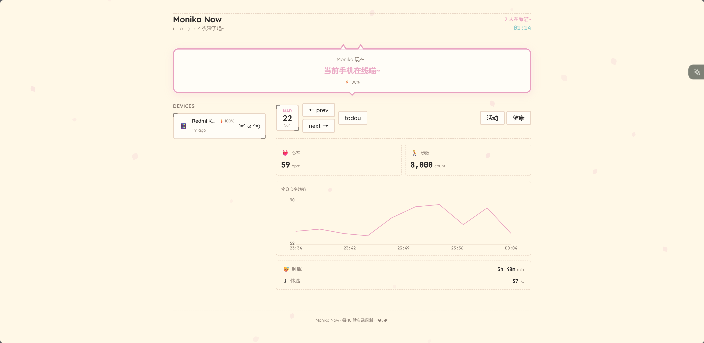

# Live Dashboard Android App

配合 [Live Dashboard](https://github.com/Monika-Dream/live-dashboard) 使用的 Android 客户端。

主要功能：上传 Health Connect 健康数据 + 可选的心跳上报（在线状态/电量）。

如果你有支持 [Health Connect](https://developer.android.com/health-and-fitness/guides/health-connect) 的穿戴设备（如 Pixel Watch、Samsung Galaxy Watch、Fitbit 等），App 会自动将健康数据转发到 Dashboard，前端即可查看心率、步数、睡眠等身体数据：

## 下载

[`live-dashboard-v2.0.apk`](./live-dashboard-v2.0.apk) — Android 8.0+ (API 26)

SHA-256: `bc14b96b11db86294fc0439e57e604b0508e0f0180fcd925b03ecc8f908b51aa`

## 源码与详细说明

见 [`android-source` 分支](https://github.com/Monika-Dream/live-dashboard/tree/android-source/agents/android-app)。
